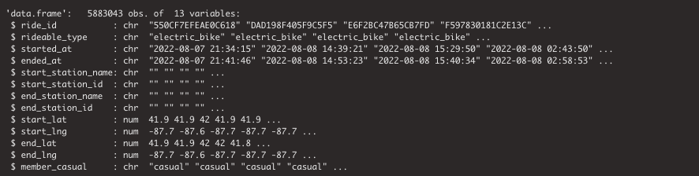
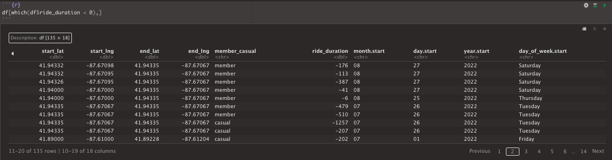

# Google Data Analytics Capstone
This is part of the module from the Google Data Analytics course from Coursera, I have posted my full repository on Github. 
The analysis follow the 6 principles of Data Analysis taught throughout the course: Ask, Prepare, Process, Analyse, Share and Act. 
In this article, I will be working with the marketing analyst team at Cyclistic, a bike sharing company in Chicago. The director of marketing believes the company's future success depends on maximising the number of annual memberships. Therefore, your team wants to understand how casual riders and annual members use Cyclistic bikes differently. From these insights, your team will design a new marketing strategy to convert casual riders into annual members. But first, Cyclistic executives must approve your recommendations, so they must be backed up with compelling data insights and professional data visualisations.

## Research Question
Design marketing strategies aimed at converting casual riders into annual members.

### Ask
- How do annual members and casual riders use Cyclistic bikes differently?
- Why would casual riders buy Cyclistic annual memberships?
- How can Cyclistic use digital media to influence casual riders to become members?

Based on three questions that was assign, as a data analyst I would need to understand the how annual membership riders compare to casual members, with that I can navigate the route map they take, the trends of time and day they are renting a bike and where can we tackle the problems to improve media influence.

### Prepare
In this process we would need to prepare the data to analyse and identify trends, by using the previous 12 months of Cyclist trip data, which can be found in the following link: [Cyclist Trip Data - divvy-tripdata.s3.amazonaws.com](https://divvy-tripdata.s3.amazonaws.com/index.html)

The data is on the AWS server where it has clear description and from a known source, the span of the data made available are from September 2021 to August 2022, it is organised in each rolling quarters by each year. The data is reliable and came from the original source from the company that is current and cited. The data source is the company so everything about the users personal information is stay hidden or kept private to the company only. 
Note: that data-privacy issues prohibit you from using riders' personally identifiable information. This means that you won't be able to connect pass purchases to credit card numbers to determine if casual riders live in the Cyclistic service area or if they have purchased multiple single passes.

### Process
Tools I have used for this project, are Excel to explore the dataset, understanding the headers and brief scan of the data that is available to check its reliability and content. 

R Studio is used to pre-process and manipulate the data to reach the objective statement. The data consist of 12 seperate csv sheet break it down to each month. All sheets contains the same header and variables.

To verify the contents of the data, we would need to check the data types and missing values for each column, by using `str()` function you can check the datatypes for each variables. 

Before cleaning, it would be efficient to bind all 12 seperate sheets into one dataframe, and begin the cleaning process for analysing. Firstly, in the dataframe there are missing variables in the timeduration column however start and end time of bike rentals does not have missing variables, so to ensure that we have sufficient variables to carry out the analysis, we need to convert the variables from character to datetime, and a function `difftime()` will determine the durations for each bike rentals, and convert the time difference column into numeric instead of characters.  

After figuring out the time difference, we checked that the time duration contained negative values, and that is considered values that are not clean and does not make sense to the objective of the task.

The next step is to remove rows that are irrelevant to the objective by using the `select(-c())` function, and observe the quantile range for the variable. 

Once those are sorted, we will breakdown the date to year, month, day, and day of the week so we can carry out descriptive analysis or aggregate the values. 

`df$month.start <- format(as.Date(df$started_at), "%m")
df$day.start <- format(as.Date(df$started_at), "%d")
df$year.start <- format(as.Date(df$started_at), "%Y")
df$day_of_week.start <- format(as.Date(df$started_at), "%A")`

### Analyse

### Share

### Act
